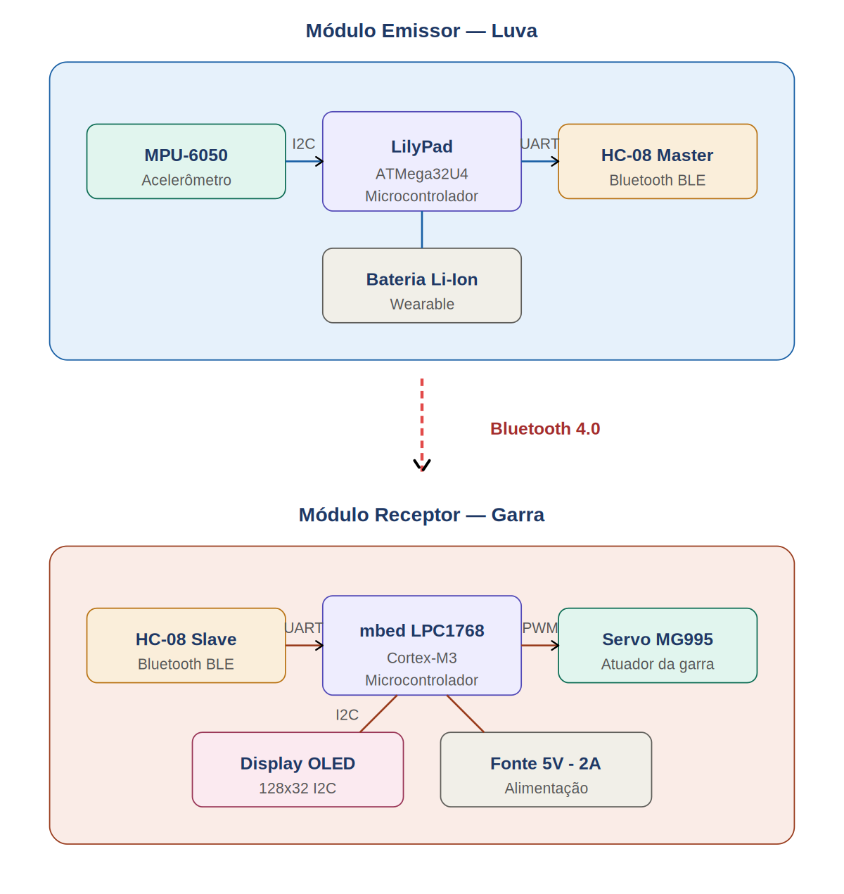

# GloveBot 🤖

Sistema embarcado de **teleoperação robótica vestível** que permite controlar uma garra mecânica através de gestos naturais da mão, via comunicação Bluetooth.

> Projeto desenvolvido para a disciplina de **Microcontroladores e Sistemas Embarcados** (Prof. Calvetti).

---

## 📋 Sobre o Projeto

O GloveBot é composto por dois módulos que se comunicam sem fio:

- **Emissor (Luva)** — captura a inclinação do pulso do usuário
- **Receptor (Garra)** — abre/fecha proporcionalmente ao gesto detectado

### Aplicação

Pensado para **robótica industrial e teleoperada**, com uso em cenários onde o operador precisa manipular objetos à distância — ambientes insalubres, perigosos ou de difícil acesso.

---

## 🛠️ Diagrama de Blocos



---

## 📸 Galeria do Projeto


### 🎥 Vídeo de Demonstração

[▶️ Assistir vídeo de demonstração](docs/WhatsApp%20Video%202026-06-03%20at%2018.21.37.mp4)

---

## 📦 Componentes

### Emissor (Luva)
| Componente | Função |
|---|---|
| LilyPad IOT ATMega32U4 | Microcontrolador vestível |
| MPU-6050 | Acelerômetro/giroscópio |
| HC-08 (Master) | Bluetooth 4.0 BLE |
| Bateria Li-ion wearable | Alimentação portátil |

### Receptor (Garra)
| Componente | Função |
|---|---|
| mbed LPC1768 (Cortex-M3) | Microcontrolador principal |
| HC-08 (Slave) | Bluetooth 4.0 BLE |
| Servo MG995 | Atuador da garra |
| Display OLED 128x32 (I2C) | Feedback visual |
| Fonte 5V-2A externa | Alimentação do servo |

---

## 🔌 Pinagem

### Emissor — LilyPad
| Periférico | Pino |
|---|---|
| MPU-6050 SDA | pino 2 |
| MPU-6050 SCL | pino 3 |
| HC-08 TXD | pino 9 |
| HC-08 RXD | pino 10 |

### Receptor — mbed LPC1768
| Periférico | Pino |
|---|---|
| Servo MG995 (PWM) | p21 |
| HC-08 TX (RX do mbed) | p14 |
| HC-08 RX (TX do mbed) | p13 |
| OLED SDA | p9 |
| OLED SCL | p10 |

---

## 📡 Protocolo de Comunicação

A luva envia comandos em formato simples via Bluetooth:

```
A<angulo>\n
```

**Exemplos:**
- `A0\n` → garra completamente fechada (0°)
- `A90\n` → garra na posição central (90°)
- `A180\n` → garra completamente aberta (180°)

---

## 🚀 Como Compilar

### Emissor (Arduino IDE)
1. Instale a biblioteca `MPU6050` da Electronic Cats
2. Selecione a placa **LilyPad Arduino USB**
3. Abra `emissor/GloveBot_emissor.ino`
4. Faça o upload

### Receptor (Keil Studio Cloud)
1. Acesse [studio.keil.arm.com](https://studio.keil.arm.com)
2. Crie um projeto **Empty Mbed OS** com target **mbed NXP LPC1768**
3. Substitua o `main.cpp` pelo arquivo em `receptor/main.cpp`
4. Compile e arraste o `.bin` para o mbed

---

## 🔗 Pareamento Bluetooth

Os módulos HC-08 são configurados via comandos AT:

- **Emissor (LilyPad)**: configurado como **Master** com `AT+ROLE=M` e `AT+CONT=1` (conexão automática)
- **Receptor (mbed)**: mantido como **Slave** (padrão de fábrica)

Ao ligar ambos os módulos, o pareamento ocorre automaticamente.

---

## 👥 Equipe

- Enzo Medeiros Grando
- Pedro Kuba Bloise
- Gustavo Henrique Lamberti Widosnck
- Gabriel Coutinho
- João Victor Pessoa de Lima dos Anjos

---

## 📄 Licença

Distribuído sob a licença MIT. Veja `LICENSE` para mais informações.
